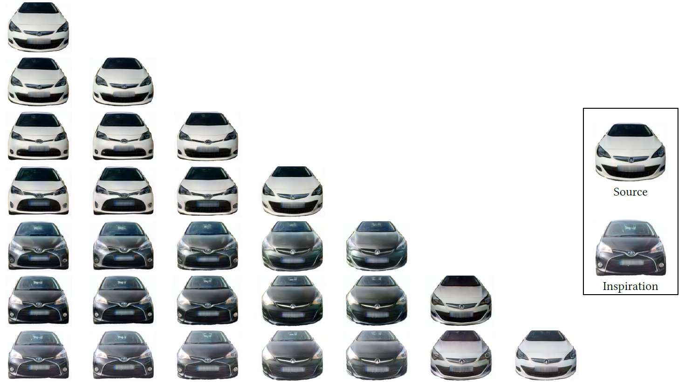

## GEO Facelift &mdash; Official implementation



### [Paper (Coming soon)]() | [Pre-trained Checkpoints](https://gla-my.sharepoint.com/:f:/g/personal/2421107h_student_gla_ac_uk/ErJBR-kRpQJJswTvpgZf36QBBsRVQrurOkZFg_NnhZ8LKA?e=bsXZ5s) | [Dataset](https://deepvisualmarketing.github.io/)

This repository has the implementation of our paper <b>*''GEO: A Computational Design Framework for Automotive Exterior Facelift''*</b>.

[Jingmin Huang](https://www.researchgate.net/profile/Jingmin-Huang-2)<sup>1</sup>,
[Bowei Chen](https://boweichen.github.io/)<sup>1</sup>,
[Zhi Yan](https://yzrobot.github.io)<sup>2</sup>,
[Iadh Ounis](http://www.dcs.gla.ac.uk/~ounis/)<sup>1</sup>
[Jun Wang](http://www0.cs.ucl.ac.uk/staff/Jun.Wang/)<sup>3</sup> <br>

<sup>1</sup>University of Glasgow<br>
<sup>2</sup>University of Technology of Belfort-Montbeliard<br> 
<sup>3</sup>University College London 


## Requirements

- Python  >=  3.6
- PyTorch >= 1.3.1
- NVIDIA GPU + CUDA 10.1/10.2


## Usage
<b> I) Design Generator </b>

> Stage1_training_StyleGAN/train_main.py 
<ul style="margin-top:-15px;"> <li> Train the StyleGAN2-based design generator</li> </ul>

> Stage2_projector/Step1_projector.py 
<ul style="margin-top:-15px;"> <li> Embed car images </li> </ul>

> Stage3_facelift_methods/my_facelift_projector.py
<ul style="margin-top:-15px;"> <li> Produce upgraded embeddings  </li> </ul>

<b> II) Design Evaluator </b>
> Step1_my_train_final_one_folder.py
<ul style="margin-top:-15px;"> <li> Train and apply the design evaluator</li> </ul>


<b> III) Decision Optimiser </b>
> optimiser_training/Stage2_train_rnn.py
<ul style="margin-top:-15px;"> <li> Train the decision optimiser</li> </ul>

> optimiser_simulating/Step2_simulate_models.py
<ul style="margin-top:-15px;"> <li> Simulate given car's long-term profit</li> </ul>


## Citation

```
@inproceedings{Huang2022geo,
  title     = {GEO: A Computational Design Framework for Automotive Exterior Facelift},
  author    = {Jingmin Huang and Bowei Chen and Zhi Yang and Iadh Ounis and Jun Wang},
  year      = {2022}
}
```

## Acknowledgements

The first author acknowledges the Adam Smith Business School and the Computing Science School of University of Glasgow’s funding support for this research. The second author would like to thank the funding support of the Region Bourgogne Franche Comté Mobility Grant and the equipment support from Nvidia Corporation through its Accelerated Data Science Grant.